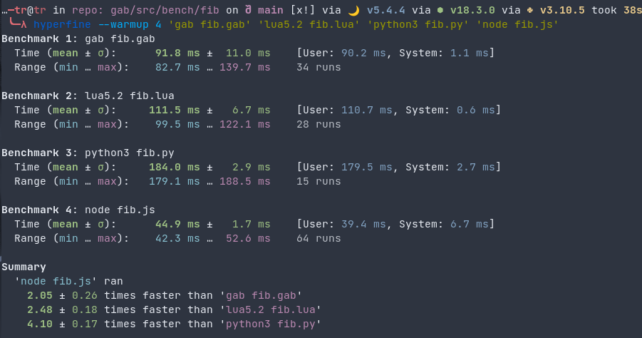

# GAB

Gab is a simple and embeddable scripting language.

```
def Person {
    def New(name, age): { name, age }

    def Celebrate_birthday(person): do
        !info('Happy Birthday {person.name}')
        person.age = person.age + 1
    end
}

let bob = Person.New('Bob', 20)
bob->Person.Celebrate_birthday()

```

# Goals

 - Be *fast*
 - Be *small*
 - Be *simple*
 - Be *extensible*

# Speed



The classic recursive fibonacci benchmark. It is mostly good for measuring arithmetic operations and function calls. Here is what it looks like in Gab:

```
def fib(n): if (n < 2): n else fib(n - 1) + fib(n - 2)
```

The benchmarks were run to a depth of 30.

# Features

Gab's more defining features include:

### Expression focused

In Gab, everything is an expression. 

`let a = if (cond): 1 else 2`

`def square(num): num * num`

When you need to a block of code, use the `do` expression!

It evaluates to the last expression in the block.

```
if (cond): !info('Hello World')

if (cond): do
  !info('Here are')

  !info('multiple expressions')
end
```

### Universal Function Call Syntax

Method chaining and OOP programming galore! Lets refer to our example above:

```
def Person {
    def New(name, age): { name, age }

    def Celebrate_birthday(person): do
        !info('Happy Birthday {person.name}')
        person.age = person.age + 1
    end
}

let bob = Person.New('Bob', 20)
bob->Person.Celebrate_birthday()

```

`Person` is just a normal object, but is serving as a namespace here. There are two functions belonging to person, `New` and `Celebrate_birthday`. 

The `->` operator is where the magic happens. Calling a function with the arrow operator automatically inserts the target as the first argument. And this can work with *any* target and *any* function. That is the beauty of *Universal Function Call Syntax*.

```
'Hello World'->!print()
```

### Shapes

Objects in Gab are governed by their *shape*. This sort of looks like *duck typing*.
```
def Point {
    x
    y
}?
```
This says *set point to the shape of an object with an x and y property*

Now, code like this works as expected:
```
let pos = { x = 10 y = 20 }
!info(pos is point)
```
This prints `true`!

### Globals
Global state in Gab is all kept in a top-level object accessed by - you guessed it - the `!` operator!

All this time, the `!print(...)` statements are calling out to a function kept in the global top level object.

The Gab CLI stores all the builtin functions in this object. If you embed Gab in your c projects, you can easily
extend this object with your own built-ins.

The object is also useful wherever global state is - like in the REPL!

```
> !msg = 'hello world'
> !info(!msg)
```

### Iterators
Right now, iterators in Gab are just normal old Gab functions.
Here is an example of one to iterate over all the elements in an ordered object:

```
def iter(i): do
  let v = -1
  ||: return ((v = v + 1), i[v])
end
```
The iterator accepts the object as the argument, and returns a lambda.
(`| args |: body`) is the syntax for a lambda - when there are no arguments it makes this funny face `||:`

The lambda uses the `return` expression to return multiple values -  the index, and the item at the index. When the list is out of elements, i[v] will return `null`
Since null is falsey, this will trigger the end of the iterator. Using it looks like this:
```
let nums = [ 1 2 3 4 ]

for index, num in iter(nums):
  !info('nums has {num} at index {index}')
```

### Dependencies

libc is the only dependency for the language - but the repo here uses check for testing.

### Whats coming up (in no particular order):

 - [ ] Decorators
 - [ ] Concurrency
 - [ ] Unicode Support
 - [ ] Finalize c api and documentation
 - [ ] CI/CD for builds and releases
