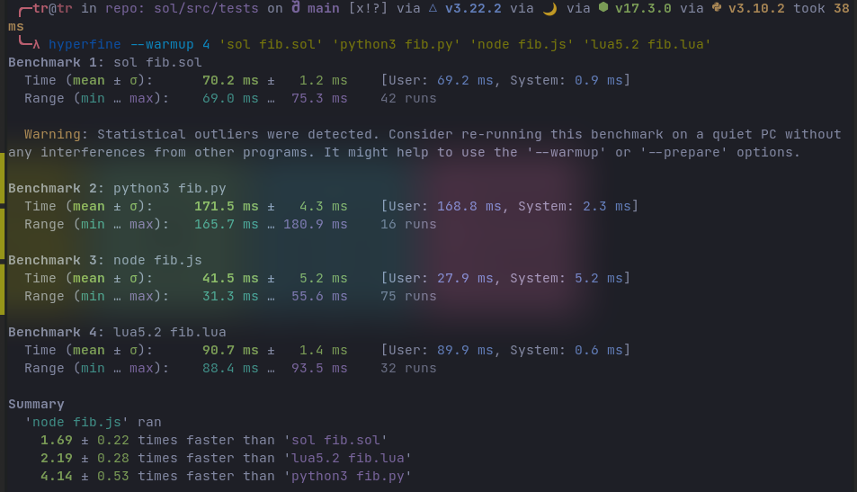

# GAB

Sol is a simple and embeddable scripting language.

```
let Person = {
    new: fn (name, age) => { name, age },
    celebrate_birthday: fn (person) then do
        std.log.info('Happy Birthday {person.name}')
        person.age = person.age + 1
    end,
}

let bob = Person.new('Bob', 20)
bob:Person.celebrate_birthday()

```

# Goals

 - Be *fast*
 - Be *small*
 - Be *simple*
 - Be *extensible*

# Speed



The classic recursive fibonacci benchmark. It is mostly good for measuring arithmetic operations and function calls. Here is what it looks like in Sol:

```
fn fib(n) =>
  if (n < 2) => n
  else fib(n - 1) + fib(n - 2)
```

The benchmarks were run for `n = 30` 

# Features

Sol's more defining features include:

### Expression focused

As seen in the fib example, simple functions can often be rewritten as an expression. The `=>` syntax indicates that the function body is an expression, not a statement. In the same vein, `if` can be an expression or a statement, indicated with a `=>` as well.

`let a = if (cond) => 1 else 2`

`fn square(num) => num * num`

When a statement is needed, use `then`

```
if (cond) then std.log.info('Hello World')

if (cond) then do
  std.log.info('Here are')

  std.log.info('multiple statements')
end
```

### Universal Function Call Syntax

Method chaining and OOP programming galore! Lets refer to our example above:

```
let Person = {
    class = { name, age }
    new = |name, age|: { name, age },
    celebrate_birthday = |self|: do
        std.log.info('Happy Birthday {self.name}')
        self.age = self.age + 1
    end
}

let bob = Person.new('Bob', 20)

bob:Person.celebrate_birthday()

```

`Person` is just a normal object, but is serving as a namespace here. There are two functions belonging two person, `New` and `Celebrate_birthday`. 

The `:` operator is where the magic happens. Calling a function with the colon operator automatically inserts the target as the first argument. And this can work with *any* target and *any* function. That is the beauty of *Universal Function Call Syntax*.

```
'Hello World':std.log.info()
```

### Dependencies

libc is the only dependency for the language - but the repo here uses check for testing.

### Whats coming up (in no particular order):

 - [X] Inline-caching
 - [X] More efficient object implementation (Using shapes)
 - [X] Shape transitions
 - [X] Extensible stdlib
 - [X] More expression based
 - [ ] Custom allocator
 - [ ] Concurrency
 - [ ] Unicode Support
 - [ ] Pattern Matching
 - [ ] Finalize c-api and documentation
 - [ ] CI/CD for builds and releases
 - [ ] Tooling
